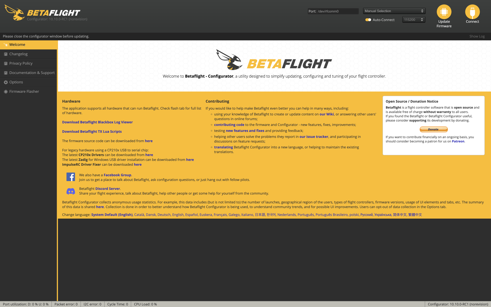

Betaflight Configuration
========================

Basic Walkthrough
-----------------
Here is the link to the installer for :ref:`**Betaflight-Configurator** <https://github.com/betaflight/betaflight-configurator/releases/tag/10.9.0>`

Drone Mesh has a good quick walkthrough that can be helpful for initial setup - :ref:`**Drone Mesh Betaflight Walkthrough** <https://www.youtube.com/watch?v=-kN349qPAH0>`

If you run into more advanced and specific problems I would advise consulting this playlsit - :ref:`**Joshua Bardwell Betaflight Playlist** <https://youtube.com/playlist?list=PLwoDb7WF6c8nT4jjsE4VENEmwu9x8zDiE&si=7g79xbEseQzUovQr>`

Trouble Shooting Techniques
---------------------------

Put a flowchart Here