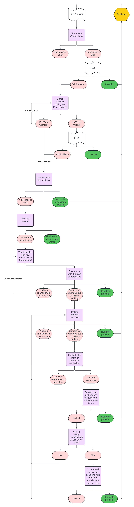

Betaflight Configuration
========================

.. image:: images/betaflight.png
   :alt: betaflight
   :align: center

Basic Walkthrough
-----------------

.. caution:: Do not under any circumstances power on your drone with propellers on. Even if they aren't locked on they can still spin off and cut you. Only do so once you have fully set up your drone, tested your motors and disarm switch on your controller and you intend to fly.

Here is the link to the installer for `Betaflight-Configurator <https://github.com/betaflight/betaflight-configurator/releases/tag/10.9.0>`_

Drone Mesh has a good quick walkthrough that can be helpful for initial setup - `Drone Mesh Betaflight Walkthrough <https://www.youtube.com/watch?v=-kN349qPAH0>`_

If you run into more advanced and specific problems I would advise consulting this playlsit - `Joshua Bardwell Betaflight Playlist <https://youtube.com/playlist?list=PLwoDb7WF6c8nT4jjsE4VENEmwu9x8zDiE&si=7g79xbEseQzUovQr>`_

Trouble Shooting Techniques
---------------------------

This can be a good rule of thumb for trouble shooting, and keep in mind you can use the bottom half for more than just the software side.

