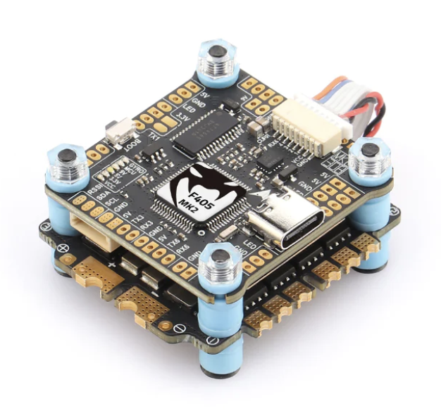
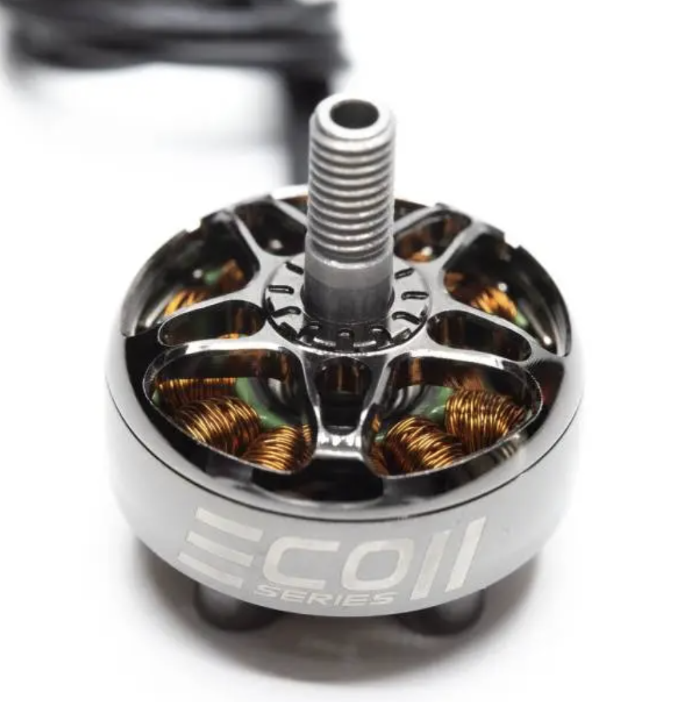
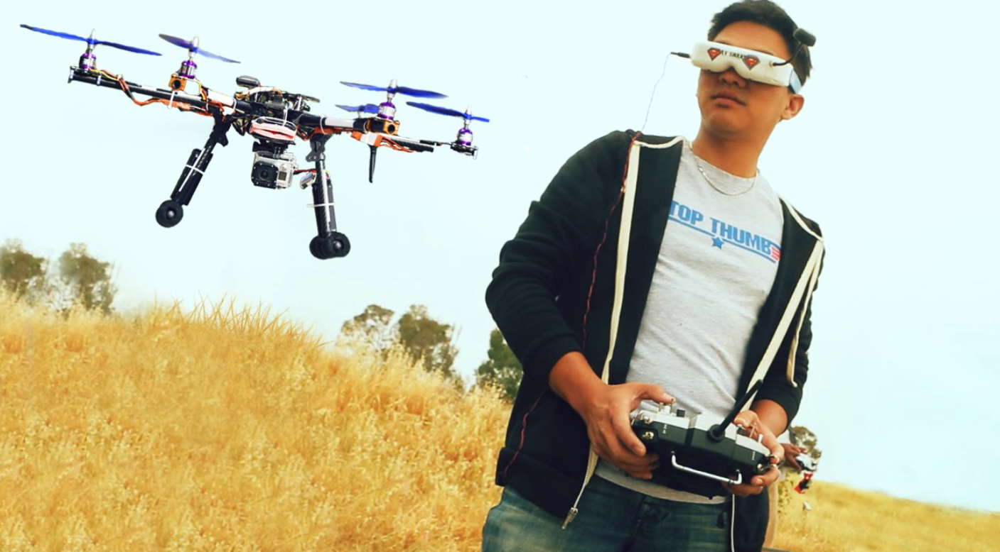
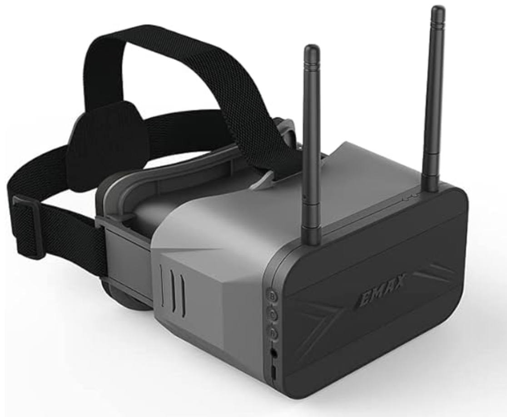
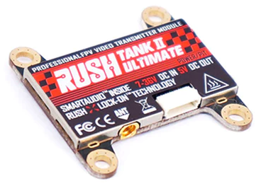
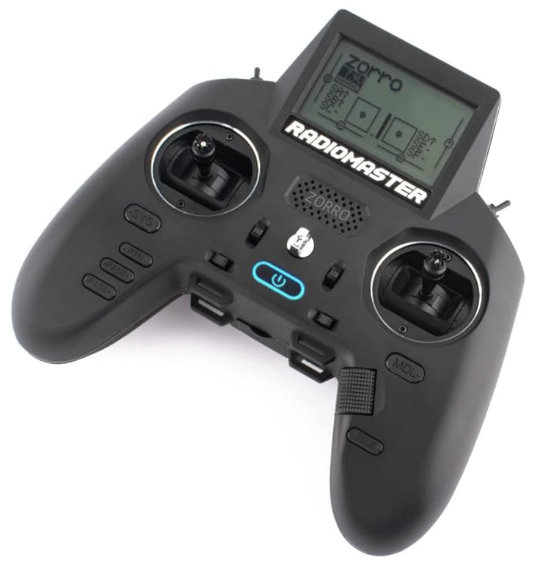
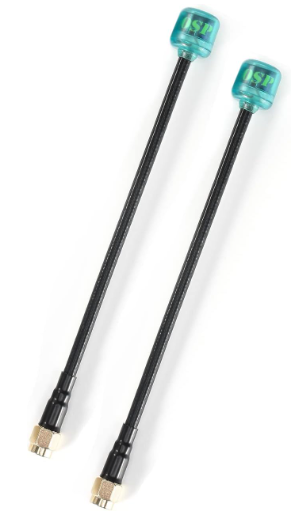

Electronics
===========

Flight Controller
-----------------

The drone flight controller is the brain of your drone. It processes all signals onboard the drone and uses it to compute the output for the motors and the signal to send to your headset so that you can get video to your goggles. 

When selecting a flight controller, it is important to check that it will fit in your frame. They come in standard mounting sizes, typically 30mm by 30mm however, it is crucial to check that it matches with your frame. 

Most modern FPV drones use a flight controller and electronic speed controller stack. This integrates the motor controllers into a single board that fits neatly below your flight controller. This offers many advantages. Firstly, it makes wiring a lot easier. Secondly, you have a major electronic system protected and contained within your frame as opposed to how ESCs are normally mounted, and lastly, it typically is a lot more economical to purchase a stack of FCs and an ESC board than an FC and then four separate ESCs. 

Your flight controller is the most key part of your drone and determines what other hardware you can use. **Investing in a solid flight controller is a good first step when building a drone.** One final point to make is that Betaflight is the most well-documented and widely used configurator for drones, so buying a flight controller that is compatible with Betaflight is a must in my opinion. Most flight controllers are, so don't stress it.

Motors
------

Control Systems
---------------
The control systems of your drone are the parts that allow you to see what the drone sees as well as send commands back to the drone. 

First Person View Setup
~~~~~~~~~~~~~~~~~~~~~~~

The first person view setup makes flying your drone feel like a video game. You don't have to visually track your drone, rather you get to see what the drone sees.

Goggles
^^^^^^^

Camera
^^^^^^

.. image:: images/camera.png
   :alt: Camera
   :align: center

Video Transmitter
^^^^^^^^^^^^^^^^^

Radio
~~~~~~~~~~~~~~~~

Radio Controller
^^^^^^^^^^^^^^^^

Radio Reciever
^^^^^^^^^^^^^^

.. image:: images/reciever.png
   :alt: Radio Reciever
   :align: center

Antennas
~~~~~~~~

