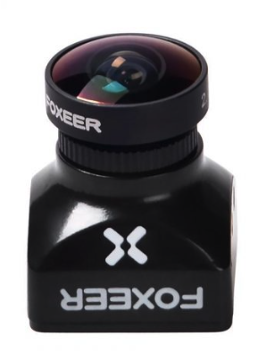

Electronics
===========

Flight Controller and ESCs
--------------------------

The drone flight controller is the brain of your drone. It processes all signals onboard the drone and uses it to compute the output for the motors and the signal to send to your headset so that you can get video to your goggles. 

When selecting a flight controller, it is important to check that it will fit in your frame. They come in standard mounting sizes, typically 30mm by 30mm however, it is crucial to check that it matches with your frame. 

Most modern FPV drones use a flight controller and electronic speed controller stack. This integrates the motor controllers into a single board that fits neatly below your flight controller. This offers many advantages. Firstly, it makes wiring a lot easier. Secondly, you have a major electronic system protected and contained within your frame as opposed to how ESCs are normally mounted, and lastly, it typically is a lot more economical to purchase a stack of FCs and an ESC board than an FC and then four separate ESCs.

.. tip:: Flight controllers are referred to as an FCs and Electronic Speed Controllers are referred to as ESCs.

Your flight controller is the most key part of your drone and determines what other hardware you can use. **Investing in a solid flight controller is a good first step when building a drone.**

.. important:: One final point to make is that Betaflight is the most well-documented and widely used configurator for drones, so buying a flight controller that is compatible with Betaflight is a must in my opinion. Most flight controllers are, so don't stress it.

Motors
------

The motors are the key part of your drone that actually make it move. The spin the propellers which in turn creates thrust and so on. 

The key specification for drone motors is their kiloVolt rating. Luckily for us somebody has already done all of the complicated math surrounding this and we can abide by the rule of thumb that you should **use 2600 kV and higher rated motors for 4" props, 2300 to 2600 kV for 5" props, and 2300 kV and lower rated motors for 6" props**. Other than that motors are fairly straightforward to select.

.. tip:: The kiloVolt rating of a motor is the number of RPMs the motor will spin per volt of power applied to it.

Control Systems
---------------
The control systems of your drone are the parts that allow you to see what the drone sees as well as send commands back to the drone. 

First Person View Setup
~~~~~~~~~~~~~~~~~~~~~~~

.. tip:: FPV stands for First Person View

The first person view setup makes flying your drone feel like a video game. You don't have to visually track your drone, rather you get to see what the drone sees.

Goggles
^^^^^^^

The goggles are the coolest part of the FPV setup. They allow you to see exactly what the drone sees. They cover your eyes and give you data readouts as well as a video feed from the drone.

When selecting goggles its all up to you. The only choice is between digital and analog. Digital goggles are vastly more expensive and I would not recommend for a beginner due to the high entry cost however they are excellent and have many advantages over the analog.

Camera
^^^^^^

The camera is, well, the camera. Not much to say about that. The main thing to look out for on the camera is the physical size as well as field of view. 

The size needs to fit your frame, and it can differ from frame to frame and be hard to tell so even if you get the wrong size for your frame there are workarounds.

.. tip:: Don't stress on the camera quality, any FPV camera will not have great quality and is only there to assist in flying. If you wish to record pristine footage you will need a GoPro mounted to your drone.

Video Transmitter
^^^^^^^^^^^^^^^^^

.. tip:: Your Video Transmitter is commonly referred to as a VTX. 

Again with your VTX you have a lot of freedom. It is worth investing in a quality and powerful VTX because that will have a big effect on your range. 

Radio
~~~~~~~~~~~~~~~~
The radio system is how you tell your drone what to do. This part is one of the hardest for specifying due to the complicated nature of all the radio protocols.

.. tip:: A radio protocol is basically the agreed upon language between your controller and receiver. Like if you were on a call with your Italian friend Stefano and you both speak in Italian because it is what you agreed upon. 🤌

Radio Controller
^^^^^^^^^^^^^^^^
.. tip:: Your Radio Controller is commonly referred to as an TX.

I would recommend selecting your radio controller before your receiver. This is due to fact that the price and capability ranges greatly among controllers with a smaller range, where as you can easily obtain a receiver that matches in protocol.

There are TX and RX protocols. The TX protocols match up with certain RX protocols. This is a great resource on `radio protocols <https://oscarliang.com/rc-protocols/>`_

But if im being honest, just get Express LRS. ELRS is simple and works well and is very versatile, not to mention it is open source and is only getting better.

Radio Receiver
^^^^^^^^^^^^^^
.. tip:: Your Radio Receiver is commonly referred to as an RX.

.. image:: images/reciever.png
   :alt: Radio Receiver
   :align: center

You shoulld select your radio receiver based on the protocol that your radio controller uses. The protocol is built into your radio receiver and will only support one RX protocol.

You can get good receivers for cheap, so save that cheddar for antennas. They pack the real punch when it comes to range and signal quality.

Antennas
~~~~~~~~

Antennas are a great way to get more performance out of your drone from upgrades after a build or even as part of a build. They can make a massive difference with signal range and quality.

There are a lot of different types of antennas for different applications. The two main differences are Directional and Omni-directional. Directional antennas provide great range however are limited in angularity and agility. Omni-directional antennas are fantastic due to their agility for the wearer. You will often see both an omni-dirctionl antenna and a directional antenna on a pilots goggles; however you almost only see omni-directional antennas on the drone itself.

.. note:: The one thing to look out for when buying antennas is the `RF connector <https://en.wikipedia.org/wiki/RF_connector>`_ type. For FPV products you'll really only see SMA MCX and UFL connectors, commonality in that order. Just pay attention to the gender of the connector and for SMA watch out for RP-SMA. Worst comes to worst though and you'll have to buy five bucks of adapters so don't stress it. 
