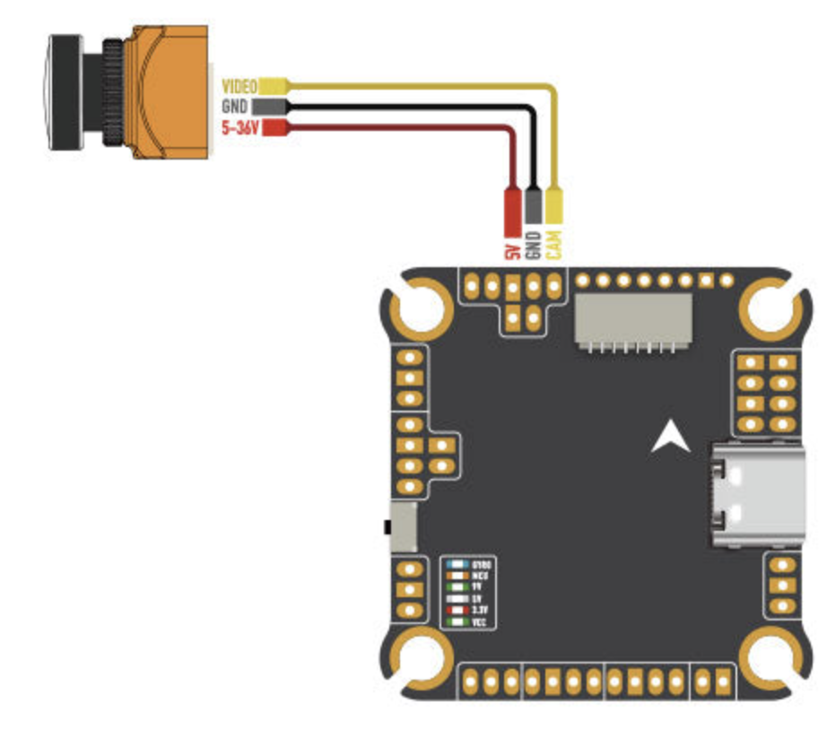

Wiring and Assembly
===================

..

Soldering
---------
All of drone wiring is going to require some soldering skill, which you can develop through this project.

If you ae inexperienced with soldering, I would recommend watching this `video from oneTesla <https://www.youtube.com/watch?v=Qps9woUGkvI>`_. After watching that practicing on some practice boards would be strongly advised, you don't want to mess up your expensive flight controller.

To get more specific drone soldering tips you can look to this `video from The Drone Racing League <https://www.youtube.com/watch?v=Ct-kvrCdGOY>`_ which is quite quick and helpful or consider this longer but still information packed `video from TRONCAT FPV <https://www.youtube.com/watch?v=2funvs3nU7U>`_.

Assembly order
--------------
After honing your soldering skills it is important to be conscious of order in which you solder and assemble your drone. I have created this list below as a recommendation for the in which you should make your drone. This is based off of difficulty and of course necessary assembly order to try and give you the opportunity to fine tune your soldering in the easier steps and move up to bigger challenges. 

1. Camera to Flight Controller
2. Video Transmitter to Flight Controller
3. Radio Transmitter to Flight Controller
4. Assemble Bottom half of frame
5. Battery Pigtail to ESC Board
6. Motors and ESC Wiring
7. Flight Controller Mounting
8. Assemble Remainder of Drone
9. Wire Management

Below I have included some tips and tricks for each step along the way.

1. Camera to Flight Controller
------------------------------
Every flight controller should come with a pin-out. This tells you where every wire needs to go. Below i've attached an example for a camera.

..

2. Video Transmitter to Flight Controller
-----------------------------------------
.. tip:: Your Video Transmitter is commonly referred to as a VTX. 

This step can get a little tricky because although your VTX cable will have 6 wires you might not need to solder all of them to your flight controller. 

This means you need to check the wiring diagram for your flight controller as well as consult the cable channels from your VTX and its specifications.

Below i've attached an example of a VTX to FC wiring diagram.

See how the the wiring can change between two different transmitters.

3. Radio Receiver to Flight Controller
-----------------------------------------
.. tip:: Your Radio Receiver is commonly referred to as an RX.

The RX can have a variety of wiring configurations. Below is an example of some RX to FC wiring diagrams. 

For the Radio Receiver what changes is the radio protocol you are using. This is built into your radio receiver so if you already have a radio controller I would advise purchasing a receiver that has a protocol supported by your controller.

Check your receivers specifications for its protocol and then consult the wiring diagram for your flight controller. 

4. Assemble Bottom half of frame
--------------------------------
Now that your flight controller is wired up its time to construct the lower half of your drone. This means start building your frame and take a break from soldering.

.. important:: Make sure not to tighten bolts too much, it should be firm but if you are exerting yourself to tighten a bolt, you doing too much.

..

5. Battery Pigtail to ESC Board
-------------------------------
Now be warned this is the hardest part of the entire build from my experience. 

This the wire that attaches your drone electronics to the battery. Its thick and the soldering pads are normally horrible. That being said once you've crossed this hump you will be in the endgame.

Credit to Just Hack it for their great tutorial here that helped me a lot when I first did this - `How To Solder XT60 to ESC | Beginners Guide <https://www.youtube.com/watch?v=KWzGA4khJGg>`_

My advice would be to take your time setting up the wires so that they can sit still while you apply solder. 

.. important:: Remember to think about how the wires will sit inside of your drone chassis. If you wire them going straight out of the ESC board and they need to go 90 degrees upwards you will have a miserable time redoing this.

Take your time figuring out the setup both on the drone and for soldering.

6. Motors and ESC Wiring
------------------------
You should first mount your ESC board to your frame. Make sure to use the rubber grommets on the stack to insulate the board from the frame.

.. tip:: Grommets are the little round pieces that are designed to go in the holes for mounting you control stack as well as in between the boards. 

This is the most consistent and straightforward part of the build. Any ESC board will have the same setup for motors. 

Every motor will have 3 wires, and every ESC board will have 3 pads for each motor.

.. note:: You should run the motor wires through the inside of the frame and then onto the soldering pads. This way your connections are not outside of the frame where they can be easily broken in a crash. This means running the wires around the bolts that hold your ESC board and FC mount to.

.. warning:: Make sure none of your connections bridge here. They tend to happen here and due to the high voltage sent to the motors if you turn on with a bridged connection here it would cause major problems. 

7. Flight Controller Mounting
-----------------------------
Now you can attack your flight controller. Ensure you space the FC from the ESC board with the rubber grommets. 

You can then use the ribbon cable to connect the ESC board to the FC.

It is at this point I would recommend plugging in your camera and VTX and powering on your drone with a `smoke stopper <https://www.getfpv.com/jhemcu-smoke-stopper-1-6s-fuse-holder-test-short-circuit-protection.html>`_.

.. caution:: DO NOT POWER ON YOUR DRONE FOR THE FIRST TIME WITHOUT A SMOKE STOPPER. Please, I beg of you, you might fry your flight controller and everything else and it will **SUCK**

.. tip:: A smoke stopper is a device that will prevent your drone from being fried if you have a short circuit. It will light up and stop the power from reaching your drone if there is a short circuit.

Assuming you pass with the smoke stopper I would recommend connecting to the drone via the USB-C port and start performing your Betaflight setup.

8. Assemble Remainder of Drone
------------------------------
Once you have performed your setup and fixed any wiring issues you can then proceed with assembling the rest of your frame. 

Secure your camera, VTX, and RX in their designated mounting points. Mount whatever antennas you have and then proceed to the next step which is highly important.

9. Wire Management
------------------
In this part of your build electrical tape and zip ties will be your best friends. You need to make sure that wires aren't floating around outside and inside of your drone.

Also ensure that wires are not stressed at the connection points or for that matter anywhere else. This sort of application is a pretty advanced that isn't really taught outside of robotics. But hey drones are robots so here you go!

.. note:: This video covers some more advanced ideas however they give the right idea about how your wires should run around the body of your drone - `How Do I Manage Wires on my Robot? <https://www.youtube.com/watch?v=8w9g18-A9L0>`_

